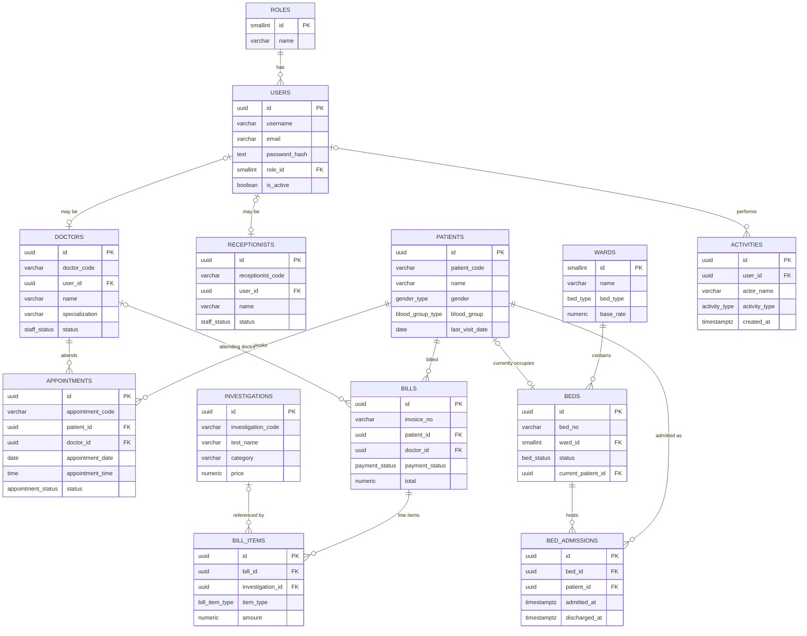

# Database Schema — Rajahmundry Orthopedic Hospital (ROH) Management System

This document defines the PostgreSQL schema for the backend that will replace the
current mock-data / `localStorage` layer used by the React frontend
(`src/constants/mockData.js`, `src/context/HospitalContext.jsx`).

Related files:
- [`schema.sql`](./schema.sql) — runnable DDL (enums, tables, indexes, triggers)
- [`seed.sql`](./seed.sql) — seed data equivalent to the current mock data, for local dev
- [`0002_hospital_settings.sql`](./0002_hospital_settings.sql) — migration adding the
  `hospital_settings` singleton table (applied after `schema.sql`; see §4.12)

---

## 1. Design Principles

1. **Normalize, don't duplicate.** The mock data stores `patientName`/`doctorName`
   redundantly on appointments, beds, and bills. The schema stores only foreign
   keys and resolves names via `JOIN`s or views. The one deliberate exception is
   `activities.actor_name`, which is an audit snapshot — it must reflect the name
   *at the time of the action*, not the current name.
2. **Surrogate keys + human-readable codes.** Every table uses a `UUID` primary
   key (`gen_random_uuid()`), which avoids sequential-ID enumeration — relevant
   for a system holding patient health data. Each entity also keeps a short
   display code (`PT001245`, `DOC001`, `APT001`, `INV-2026-001`, ...) generated
   from a `SEQUENCE`, matching what the UI already renders.
3. **Prefer soft delete for medical/financial records.** Patients, doctors, and
   receptionists get a `deleted_at` column instead of `DELETE`. Appointments and
   bills are never physically deleted — "cancel" is a status, not a row removal.
   This preserves the audit trail the current app's "Recent Activities" feed
   implies but doesn't actually guarantee. Only pure catalog data
   (`investigations`) can be truly deactivated via `is_active`.
4. **Constrain state at the database level**, not just in the frontend. Enums
   for statuses, `CHECK` constraints for invariants (e.g. a bed can't be
   `Occupied` without a patient), and `UNIQUE` constraints for things like
   double-booking a doctor's time slot.
5. **History over overwrite.** The mock model overwrites bed state in place on
   admit/discharge, losing history. The schema adds `bed_admissions` as an
   append-only log, while `beds` keeps a denormalized "current state" column
   for fast dashboard reads.

---

## 2. Entity-Relationship Diagram

---

## 3. Enum Types

| Enum | Values | Used by |
|---|---|---|
| `gender_type` | `Male`, `Female`, `Other` | `patients.gender` |
| `blood_group_type` | `A+`, `A-`, `B+`, `B-`, `AB+`, `AB-`, `O+`, `O-` | `patients.blood_group` |
| `staff_status` | `Active`, `Inactive` | `doctors.status`, `receptionists.status` |
| `appointment_type` | `Consultation`, `Therapy`, `Follow Up`, `Surgery`, `Emergency` | `appointments.type` |
| `appointment_status` | `Scheduled`, `Completed`, `Cancelled`, `No Show` | `appointments.status` |
| `bed_type` | `General`, `Semi-Private`, `Private Suite`, `Critical Care` | `wards.bed_type` |
| `bed_status` | `Available`, `Occupied`, `Maintenance` | `beds.status` |
| `bill_type` | `OPD`, `IPD`, `Pharmacy`, `Lab` | `bills.bill_type` |
| `payment_mode` | `Cash`, `Card`, `UPI`, `Insurance`, `Net Banking` | `bills.payment_mode` |
| `payment_status` | `Paid`, `Pending`, `Partially Paid`, `Refunded` | `bills.payment_status` |
| `bill_item_type` | `Consultation`, `Investigation`, `Therapy`, `Pharmacy`, `Room Rent`, `Procedure`, `Other` | `bill_items.item_type` |
| `activity_type` | `appointment`, `patient`, `billing`, `medical`, `bed`, `doctor`, `receptionist`, `auth`, `general` | `activities.activity_type` |

Enums are used instead of free-text so invalid statuses are rejected at the
database layer, not just in a React `<select>`.

---

## 4. Data Dictionary

### 4.1 `roles`
Static lookup table for access levels.

| Column | Type | Notes |
|---|---|---|
| `id` | `SMALLSERIAL PK` | |
| `name` | `VARCHAR(30) UNIQUE` |  `Admin`, `Doctor`, `Receptionist` |

### 4.2 `users`
Central authentication table. Every person who can log in — admins, doctors,
receptionists — has exactly one row here. This replaces the hardcoded
`admin/admin123` check in `AuthContext.jsx`.

| Column | Type | Notes |
|---|---|---|
| `id` | `UUID PK` | |
| `username` | `VARCHAR(50) UNIQUE NOT NULL` | |
| `email` | `VARCHAR(150) UNIQUE NOT NULL` | |
| `password_hash` | `TEXT NOT NULL` | bcrypt/argon2 hash, never plaintext |
| `full_name` | `VARCHAR(150) NOT NULL` | |
| `role_id` | `SMALLINT FK -> roles.id` | |
| `avatar_url` | `TEXT` | |
| `is_active` | `BOOLEAN DEFAULT TRUE` | disable login without deleting the account |
| `last_login_at` | `TIMESTAMPTZ` | |
| `created_at` / `updated_at` | `TIMESTAMPTZ` | |

### 4.3 `doctors`
| Column | Type | Notes |
|---|---|---|
| `id` | `UUID PK` | |
| `doctor_code` | `VARCHAR(10) UNIQUE` | auto: `DOC001`, `DOC002`, ... |
| `user_id` | `UUID UNIQUE FK -> users.id` | nullable — a doctor row can exist before a login is provisioned |
| `name` | `VARCHAR(150) NOT NULL` | |
| `specialization` | `VARCHAR(100) NOT NULL` | |
| `phone` | `VARCHAR(15) NOT NULL` | |
| `email` | `VARCHAR(150) UNIQUE` | |
| `status` | `staff_status DEFAULT 'Active'` | |
| `availability_note` | `VARCHAR(100)` | display text, e.g. `9:00 AM - 1:00 PM` |
| `experience_years` | `SMALLINT` | |
| `created_at` / `updated_at` / `deleted_at` | `TIMESTAMPTZ` | soft delete |

### 4.4 `receptionists`
Same shape as `doctors` minus specialization/experience, plus `shift` (free text,
e.g. `Morning (8 AM - 4 PM)`).

### 4.5 `patients`
| Column | Type | Notes |
|---|---|---|
| `id` | `UUID PK` | |
| `patient_code` | `VARCHAR(12) UNIQUE` | auto: `PT001246`, ... (seeded to continue after mock data's `PT001245`) |
| `name` | `VARCHAR(150) NOT NULL` | |
| `age` | `SMALLINT CHECK (0-150)` | |
| `date_of_birth` | `DATE` | optional, more precise than age alone |
| `gender` | `gender_type NOT NULL` | |
| `phone` | `VARCHAR(15) NOT NULL` | indexed |
| `address` | `TEXT` | |
| `blood_group` | `blood_group_type` | |
| `primary_diagnosis` | `VARCHAR(200)` | the mock data's `disease` field |
| `last_visit_date` | `DATE` | |
| `created_at` / `updated_at` / `deleted_at` | `TIMESTAMPTZ` | soft delete |

### 4.6 `investigations`
Lab/radiology test catalog.

| Column | Type | Notes |
|---|---|---|
| `id` | `UUID PK` | |
| `investigation_code` | `VARCHAR(10) UNIQUE` | auto: `INV001`, ... |
| `test_name` | `VARCHAR(150) NOT NULL` | |
| `category` | `VARCHAR(60) NOT NULL` | `Radiology`, `Pathology`, `Cardiology`, ... (free text; promote to a lookup table if the list needs to be admin-managed) |
| `price` | `NUMERIC(10,2) CHECK (>= 0)` | |
| `is_active` | `BOOLEAN DEFAULT TRUE` | catalog deactivation instead of delete |

### 4.7 `appointments`
| Column | Type | Notes |
|---|---|---|
| `id` | `UUID PK` | |
| `appointment_code` | `VARCHAR(10) UNIQUE` | auto: `APT001`, ... |
| `patient_id` | `UUID NOT NULL FK -> patients.id ON DELETE RESTRICT` | |
| `doctor_id` | `UUID NOT NULL FK -> doctors.id ON DELETE RESTRICT` | |
| `appointment_date` | `DATE NOT NULL` | |
| `appointment_time` | `TIME NOT NULL` | |
| `type` | `appointment_type DEFAULT 'Consultation'` | |
| `status` | `appointment_status DEFAULT 'Scheduled'` | |
| `fee` | `NUMERIC(10,2) DEFAULT 0 CHECK (>= 0)` | |
| `notes` | `TEXT` | |
| `created_at` / `updated_at` | `TIMESTAMPTZ` | |

`UNIQUE (doctor_id, appointment_date, appointment_time)` prevents double-booking
the same doctor into the same slot — a rule the current frontend does not
enforce at all.

### 4.8 `wards` and `beds`
`wards` models the four ward types seen in mock data (`General Ward`,
`Semi Private`, `Private Room`, `ICU`) with a `base_rate` for billing.

`beds` keeps a fast "current state" snapshot:

| Column | Type | Notes |
|---|---|---|
| `id` | `UUID PK` | |
| `bed_no` | `VARCHAR(10) UNIQUE` | `101`, `201`, ... matches mock data |
| `ward_id` | `SMALLINT FK -> wards.id` | |
| `status` | `bed_status DEFAULT 'Available'` | |
| `current_patient_id` | `UUID FK -> patients.id ON DELETE SET NULL` | |
| `created_at` / `updated_at` | `TIMESTAMPTZ` | |

`CHECK` constraint: `status = 'Occupied'` requires `current_patient_id IS NOT NULL`,
and any other status requires it to be `NULL`. This makes the invalid state the
mock data allows (an "Occupied" bed with no patient) unrepresentable.

### 4.9 `bed_admissions`
Append-only admission/discharge history — a gap in the current mock model,
where `releaseBed()` simply overwrites the bed row and the stay is gone.

| Column | Type | Notes |
|---|---|---|
| `id` | `UUID PK` | |
| `bed_id` | `UUID FK -> beds.id` | |
| `patient_id` | `UUID FK -> patients.id` | |
| `admitted_at` | `TIMESTAMPTZ DEFAULT now()` | |
| `discharged_at` | `TIMESTAMPTZ` | `NULL` while the stay is active |

A partial index on `bed_id WHERE discharged_at IS NULL` makes "is this bed
currently occupied" queries cheap and also gives the app a place to enforce
"one active admission per bed" if desired.

### 4.10 `bills` and `bill_items`
The mock model stores `items` as an array embedded in the bill object. The
schema normalizes this into a header/line-item pair so items can be reported on,
linked back to the investigation catalog, and totals can be recomputed/audited.

**`bills`**

| Column | Type | Notes |
|---|---|---|
| `id` | `UUID PK` | |
| `invoice_no` | `VARCHAR(20) UNIQUE` | auto: `INV-2026-001`, year-scoped sequence |
| `patient_id` | `UUID NOT NULL FK -> patients.id ON DELETE RESTRICT` | |
| `doctor_id` | `UUID FK -> doctors.id ON DELETE SET NULL` | nullable — pharmacy/lab-only bills may have no doctor |
| `bill_date` | `DATE DEFAULT CURRENT_DATE` | |
| `bill_type` | `bill_type NOT NULL` | |
| `payment_mode` | `payment_mode` | nullable until paid |
| `payment_status` | `payment_status DEFAULT 'Pending'` | |
| `sub_total`, `discount`, `tax`, `total` | `NUMERIC(12,2) CHECK (>= 0)` | |
| `created_at` / `updated_at` | `TIMESTAMPTZ` | |

**`bill_items`**

| Column | Type | Notes |
|---|---|---|
| `id` | `UUID PK` | |
| `bill_id` | `UUID NOT NULL FK -> bills.id ON DELETE CASCADE` | |
| `investigation_id` | `UUID FK -> investigations.id` | nullable — only set when the line item is a catalog test |
| `description` | `VARCHAR(200) NOT NULL` | |
| `item_type` | `bill_item_type NOT NULL` | |
| `quantity` | `SMALLINT DEFAULT 1 CHECK (> 0)` | |
| `amount` | `NUMERIC(10,2) CHECK (>= 0)` | |

### 4.11 `activities`
Audit/activity feed backing the dashboard's "Recent Activities" widget.

| Column | Type | Notes |
|---|---|---|
| `id` | `UUID PK` | |
| `user_id` | `UUID FK -> users.id ON DELETE SET NULL` | who performed the action (nullable if the user is later deleted) |
| `actor_name` | `VARCHAR(150) NOT NULL` | **intentional denormalization**: audit snapshot of the actor's name at the time |
| `action` | `TEXT NOT NULL` | human-readable description, e.g. `Assigned bed 101 to Ramesh Babu` |
| `activity_type` | `activity_type DEFAULT 'general'` | |
| `entity_type` | `VARCHAR(50)` | e.g. `patient`, `appointment` — for linking back to the source row |
| `entity_id` | `UUID` | polymorphic reference (no FK — logs must survive deletion of the referenced row) |
| `created_at` | `TIMESTAMPTZ DEFAULT now()` | the mock data's relative `"10 mins ago"` is computed client-side from this |

### 4.12 `hospital_settings`
Added in `0002_hospital_settings.sql`. A singleton row (enforced by
`CHECK (id = 1)`) backing the Settings page's "Hospital Metadata" tab, which
previously had no persistence at all — form edits vanished on refresh.

| Column | Type | Notes |
|---|---|---|
| `id` | `SMALLINT PK DEFAULT 1 CHECK (id = 1)` | enforces exactly one row |
| `name` | `VARCHAR(200) NOT NULL` | |
| `address` | `TEXT` | |
| `contact_phone` | `VARCHAR(30)` | |
| `license_number` | `VARCHAR(100)` | |
| `updated_at` | `TIMESTAMPTZ NOT NULL DEFAULT now()` | |

---

## 5. Indexes

| Table | Index | Reason |
|---|---|---|
| `patients` | `phone` | receptionist lookup by phone |
| `appointments` | `patient_id` | patient's appointment history |
| `appointments` | `(doctor_id, appointment_date)` | doctor's daily schedule |
| `appointments` | `status` | dashboard "upcoming/scheduled" filters |
| `bed_admissions` | partial index `bed_id WHERE discharged_at IS NULL` | "current occupant" lookups |
| `bill_items` | `bill_id` | fetch line items for an invoice |
| `activities` | `created_at DESC` | dashboard feed, most-recent-first |

---

## 6. Auto-Updating `updated_at`

Every table with an `updated_at` column gets a `BEFORE UPDATE` trigger calling
a shared `set_updated_at()` function (defined once in `schema.sql`), so
application code never has to remember to bump the timestamp manually.

---

## 7. Mock Data → Schema Field Mapping

For writing the eventual seed/import script:

| Mock field | Schema location |
|---|---|
| `patients[].id` (`PT001245`) | `patients.patient_code` |
| `patients[].disease` | `patients.primary_diagnosis` |
| `doctors[].id` (`DOC001`) | `doctors.doctor_code` |
| `doctors[].availability` | `doctors.availability_note` |
| `doctors[].experience` (`"15 Years"`) | `doctors.experience_years` (parsed to `15`) |
| `appointments[].patientName` / `doctorName` | dropped — resolved via `JOIN` on `patient_id` / `doctor_id` |
| `beds[].patientId` / `patientName` | `beds.current_patient_id` (+ `bed_admissions` row) |
| `bills[].items[]` | rows in `bill_items` |
| `activities[].time` (`"10 mins ago"`) | computed from `activities.created_at`, not stored |

---

## 8. Deliberately Out of Scope (for now)

- **Row-Level Security policies** — worth adding once roles/tenancy requirements
  are firmer.
- **Doctor weekly schedule / slot table** — `availability_note` is free text for
  now, matching the current UI; a proper `doctor_schedules` table (day of week
  + time ranges) is a natural v2 addition once online booking needs real slot
  validation.
- **Investigation `category` as a lookup table** — kept as text; promote to a
  table if categories need to be admin-managed rather than fixed.
